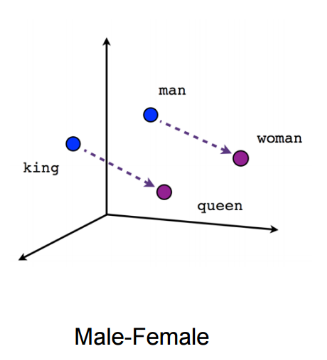
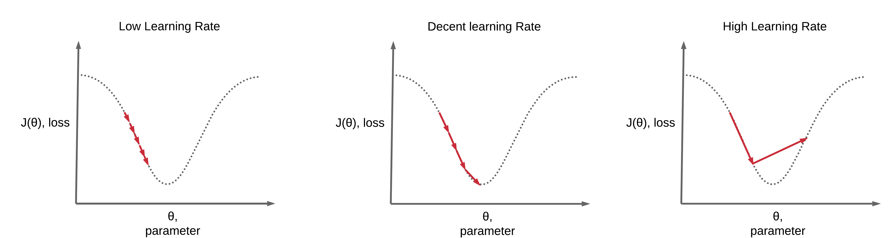

# atos-mentorship-task
 
### **What is a neural network neuron?**
A neuron is the basic unit of a neural network. Multiple neurons form a layer and a neural network is made up of a number of these layers.  
- Each neuron can take multiple inputs and has a weight vector associated with it. The neuron multiplies the inputs with these weights and provides a single scalar output which is the sum of these multiplied inputs with a bias subtracted from it.  
- This scalar output is then passed on to an activation function that transforms the weighted sum into the output from the node.  
- This activation function is generally a non-linear function with various possible outputs that also help signify the degree of activation of the neuron. This allows the neural network to solve non-trivial problems with a reasonable number of neurons and layers.
  
### **What is an activation function?** 
An activation function is essentially a "gate" of sorts between the input of a neuron and the output. It determines whether the given inputs will result in any output from the neuron (neuron is activated or not) and what that output will be (degree of activation).  

Commonly used activation functions are:
**1. Sigmoid function:**  The sigmoid function is of the form f(z)=1/(1+e-z).
  - The sigmoid curve looks like an S:  
    
  - Sigmoid function takes any input and transforms it between the range of 0 to 1. 
  - As a result, sigmoid function is mostly used for classification problems, or situations where a probability has to be calculated.
  - Sigmoid function suffers from a few drawbacks since the function isn't centered around 0, and as it reduces the there's almost no change in the output for very large and very small values of z, it also suffers from a vanishing gradient problem.  

**2. tanh function:** The tanh function is of the form f(z) = tanh(z) = (ez-e-z)/(ez+e-z).  
  - The graph also has an S-shape, similar to the sigmoid function:  
    
  - Unlike the sigmoid function, tanh function ranges from -1 to 1 and has a stronger distinction between negative and positive values.  
  - Since tanh is centered around 0, unlike sigmoid function, and there's a stronger distinction between negative and positive values, it has performs better than the sigmoid function since it provides larger gradients.  
  - Tanh is also use for probabilistic predictions.  

**3. Softmax function:**  
  - In multiclass classification problems, it's highly desirable to get the probability for each class label as a value between 0 and 1, and the sum of these probabilities to be equal to 1.  
  - The softmax activation function is used in the output layer of the NN to enforce the above constraints.  
  - The softmax function is presented as  for each output node.  
  - Softmax function is essentially a combination of multiple sigmoid functions and actually reduces to a single sigmoid function for a binary classification problem.  

**4. Rectified linear unit(ReLU):** ReLU is currently the most commonly used activation function.  
  - It's a simple function of the form f(z) = max(0.0,z).  
    
  - It resolves the problem of the vanishing gradient that affects the sigmoid and tanh functions since the derivative is either 1 or 0. Its simple nature also makes it compute much faster than the previous functions that used exponents.  
  - While it resolves the vanishing gradient problem, it also suffers from a drawbacks like overfitting and a unique problem known as the "Dying ReLU":  
    - All negative values are directly converted to 0 and the gradient of the function becomes 0. If this happens to too many neurons, the network suffers from a sparsity problem and is unable to perform proper backpropagation.  
  - These drawbacks are overcome by techniques like:  
    - Using dropouts: Some nodes in a layer are randomly ignored during training, this avoids overfitting by making sure that the network doesn't rely on the output of a select few nodes.  
    - Using variations of ReLU such as Leaky ReLU: Leaky ReLU gives a non-zero value to negative values by using a function like f(z) = max(0.01x,x). This ensures that even negative values have a small positive slope. This prevents the dying ReLU problem and backpropagation can continue for negative values.  
    
### **Why do we need activation function in Neural Network?**    
- Without an activation function, a neuron will simply return the sum of the inputs multiplied by the weights. 
- This linear transformation, while computationally simple, is unable to solve any complex, non-trivial problems. It would act like a linear regression model. 
- On the other hand if non-linearity is added, a neural network, if used properly, can always represent an approximation for almost any transformation. 
- As a result, an activation function is used to add non-linearity to the neural network and allow it to solve complex problems with a reasonable number of neurons and layers.  
  

    

### **What is "loss" in a neural network?**
"loss" in a neural network gives us an idea of how much a predicted value returned by the NN differs from the actual value. It is also called the error. The function used to measure this "loss" for each training input is called a loss function. It is essentially a measure of how poorly the NN performs for the given training input. Since the loss function has to be selected by the programmer, it is important to select the right loss function for a given task. For example for a regression model where the goal is to predict a continuous value, mean squared error would be an appropriate loss function. But for a classification model, we use log-based loss functions such as binary or categorical cross-entropy based on the number of possible classes.

### **What do you mean by embeddings?**  
Embeddings in machine learning, and especially NLP allow us to represent high-dimensional vectors in a low-dimensional space. This technique improves the ability of NLP models to learn from the given data.  
For example lets say we're trying to perform sentiment analysis on a given text corpus: 
- Now the number of possible words is as large as the vocabulary of the average person, this can be around 40000 to 50000 words.  
- The most basic way to represent these words as data would be to use One Hot Encoding and have each word represented by a sparse vector(a vector with very few non-zero values), where each position corresponds to a specific word. Maybe we could make a vector that contains non-zero values for all the words in a sentence, each representing their frequency.
- At the end of the day, these vectors are still sparse and give very little information in such a large space. The word "animal" at index 1200 is just as related to "cloud" at index 1800 as it is to "dog" at index 600, even though there should be a closer relation between "animal" and "dog".

We solve this problem through Embedding:  
- Embedding allows us to represent these relations by placing these words in a multi-dimensional space. 
- Closely related words can be placed together while dissimilar words can be placed further away from each other in this space.  
- We can set certain separations such as all inanimate objects being (...,-1,0....) and all animate objects being (...,1,0....) or improve certain relations by setting up situations like "ruler"+"man"="king" and "ruler+woman"="queen". 
- These relations, relative positions and reduction of the space helps provide additional information to NLP models and improves their ability to learn.  
- Embedding also makes it much easier to visualize the relations between different words. Like in the following graph we can see that the relation between king and queen is similar to the relation between man and woman, even though they're not in the same location.  
  

Embeddings can also be used in other systems such as embedding various books in an n-dimensional space based on various factors such as their genres, audience and other such factors. This allows us to place similar books in the same area and use this embedded data to develop a book recommendation system.  
  
### **Define RNN**
Recurrent neural networks are neural networks that allow the use of previous outputs as inputs. 
- In a normal feed-forward NN where information moves straight through the NN and never enters the same node twice. 
- But in an RNN, this information also cycles through a loop back into the node with the help of a short-term internal memory. This allows the network to learn from the current input AND the previous inputs. 
- RNNs allow us to develop models that can work with sequential data and time-series data. 
- For example when trying to derive meaning from a sentence such as "There were 17 cans in the aisle, but Alan broke 3 of them", the order of the words matters. In a normal feed-forward NN, if words are entered 1-by-1, by the time we reach the word "aisle" the NN has no memory of "17" but an RNN can learn from the contextual data.  
- Unlike feed-forward networks where one set of inputs can only be mapped to one input, an RNN allows us to map one-to-one, one-to-many, many-to-many(translation of sentences) and many-to-one(voice classification).  
  
- Basic RNNs do suffer from the vanishing gradient problem, resulting in rather short-term memory. This vanishing gradient problem is resolved by using LSTM units when building the RNN.  
- LSTMs contain information in a memory and can choose to read, write and delete information from this memory.  
  
### **What are gradients?**
- For a neural network to learn, once the data is altered by the weights and passed through the NN these weights need to be updated to minimize the difference between the predicted outcome and the actual(expected) outcomes. 
- The "loss" or error helps us measure the difference between the expected and predicted values. This error is passed backwards through the neural network by each neuron, and each neuron sends its own error backwards. 
- This process is called backpropagation of errors. The weights for neurons are updated according to these errors.  
- A cost function(which is an interpretation of the loss of all the samples in the given test data or batch) is used to measure the overall error for the neural network. 
- This implies that the lowest point of this cost function(when plotted based on weights) gives us the optimal value for these weights. For example in the following image if we start at A, the optimal value for weights would be at B.  

- To find this "lowest point" or minimum, we make use of the slope, or gradients. We get this gradient by getting the derivative of the cost function with respect to the weights.  
Generally the higher the error, the higher the gradient and the more we need to change the weight.
- This process can be simply represented in a 2D parabolic graph:  

But this brings up a new question:  
**How should the new weights be calculated?**  
- Weights need to be gradually changed from so that we reach the cost minimum at a reasonable rate. This rate is called the learning rate. This rate determines the size of each step that's taken, as a result it's also called the step size.
- In basic gradient descent, this learning rate is kept at a constant value and as a result it must be chosen appropriately.
- As a result, it is very important to select a learning rate that's isn't so large that it'll cause drastic updates and frequently overshoot the minimum.
- At the same time it's also important to select a learning rate that isn't so small that the network takes an extremely long time to reach the minima.
- The impact of learning rates can be depicted as:  
 
- Once an appropriate learning rate is selected, to get the new weights, we simply multiply the derivative with the learning rate and subtract it from the previous weights. This process is repeated until we reach the minimum point.  
- Another important part to note is that NNs use stochastic gradient descent, where the weights are updated for each training sample one-by-one. 
- This method gives us a detailed rate of improvement, might lead to the minimum faster than normal gradient descent(also called batch gradient descent) and tries to prevent the cost function from settling at a local minima in case it has multiple local minima.  

### **What are optimizers?**
The above methods of gradient descent and stochastic gradient descent have a few drawbacks.:
 - Choosing a proper learning rate isn't easy. Even if a small enough learning rate is chosen to avoid drastic fluctuations, if the starting weights happen to far away from the minima it could take a long time to get to it. 
 - Learning rate schedules may be used to start with a larger learning rate and reduce it according to a specific schedule, but these schedules have to be predefined and don't adapt to different datasets. 
 - Since the same learning rate applies to all parameters, in spare datasets where features have different frequencies the network ends up updating weights even when it isn't ideal. It might be preferrable to perform larger updates for features with a low frequency.
 - Lastly, in highly non-convex functions, it's difficult to avoid getting trapped in local minimas and saddle points(where the slope goes up on one side and down on the other, but the remaining surrounding form a plateau of sorts with the same error).

These problems are solved using various optimizers such as:  
**1. SGD with momentum:**  
  - The problem with standard SGD is that when the when it reaches an area with a an extremely steep slope in one dimension and a gentle slope in another dimension, it oscillates wildly a across the steeper slopes but makes small progress towards the gentler slope.  

  - This problem is resolved by adding a fraction of older update vectors to the new update vectors. The update vector is modified as such:  
    
    - Where V is the momentum factor  
      γ is the coefficient of momentum  
      α is the learning rate  
      ∇wJ(w) is the derivative of the cost function wrt weights and  
      w are the weights 
  - This makes it so that the SGD gains "momentum" towards the minima, speeding up the rate at which it reaches the minima.  
    
  - The network also avoids getting stuck at the minima as it will continue moving past the minima like a ball tossed into a bowl. If the minima is the global minima, the network will end up there, but if there's another, more appropriate minima nearby the network is able to continue moving towards it.  

**2. RMSProp:**  
  - RMSProp tries to resolve the issue of a constant learning rate by changing it based on the gradients in every update.  
  - It does this by maintaining a "cache" value that keeps track of the squares of the gradients up to the current update.  
  - The previous optimizer that used this method(Adagrad) had a problem where it accumulated the squares of the gradients up to a point where the sum became too large and the learning rate kept on shrinking to extremely small values. 
  - RMSProp resolves this by introducing a decay rate(γ), that reduces the rate at which the square of gradients get added. This ensures that while the learning rate changes based on previous updates, it doesn't shrink too much.  
  - The cache and weight updating is done as follows:  
      
    ϵ is just a small number used to ensure that division by 0 doesn't take place. 
  - RMSProp ensures a proper learning rate that starts of fast but slows down as the network gets closer to the minima without needing to manually update it.

**3. Adam:**
  - Adam or Adaptive Moment Estimation acts like a combination of momentum and RMSProp
  - Along with maintaining an exponentially decaying average of the squares of gradients like RMSProp, it also maintains an exponentially decaying average of past gradients like momentum(called m). 
  - It does this using the following equations:    
  
  Where β1 and β2 are decay rates that have to be selected.
  - Since m and cache vectors are initialized to 0, they tend to biased toward 0. This bias is corrected using the following formulae:  
    
  - Finally, the weights are updated according to both terms:  
   

